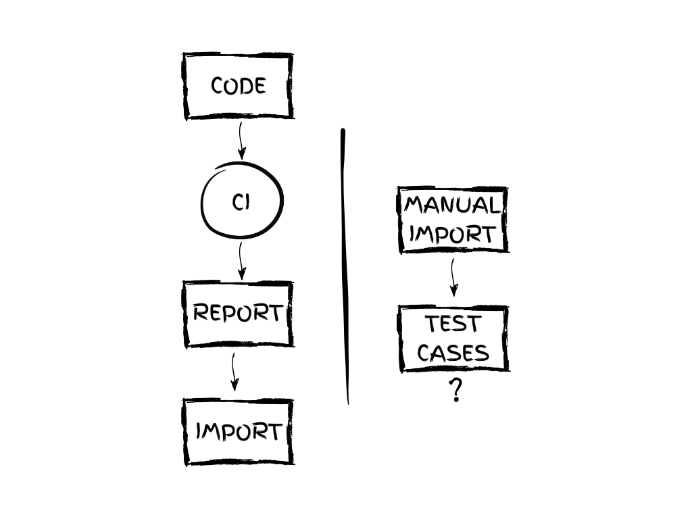
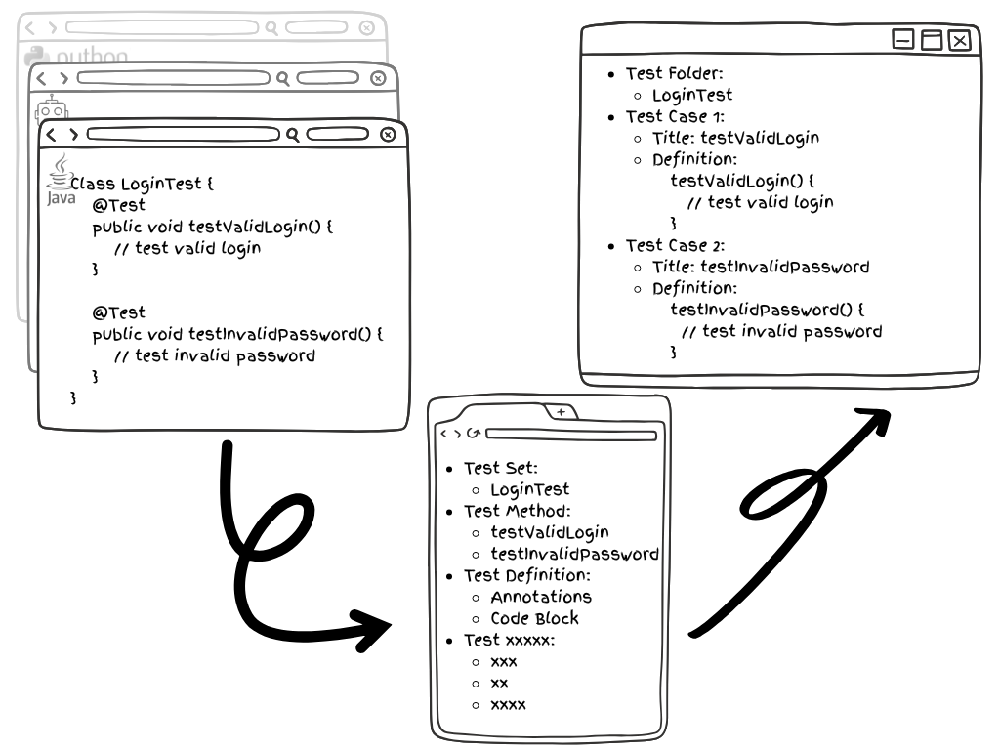

# 📘 Script-as-Test: A Whitepaper on the Collaborative Model for Automated Testing

> Front-loading Test Assets — How to Make Automated Tests Visible

## Introduction: A Neglected Fault Line

In the world of software development, testing is often treated as a side stream running parallel to development. Yet in today’s era of increasingly widespread automated testing, a growing gap is forming between this side stream and the mainstream development process.

This gap doesn’t stem from whether test scripts are written, but from whether they are recognized as workflow assets. In other words, scripts are written and executed—but remain invisible.

Most companies manage test cases using tools like Jira, TestRail, Xray, or Zephyr. However, the vast majority of these test cases still rely on manual input—which not only refers to form-filling by hand, but also includes semi-automated processes like importing test cases from CI reports. While execution is automated, test assets remain unstructured and unmanaged. Common issues include:

- Test results copied and pasted manually into management platforms;
- CI platforms import only execution status—not structure or logic;
- Test cases lack traceable script origins, structure, or context.

All of these actions have one thing in common: **test scripts and test management workflows are completely disconnected**. Even if a test script has been executed hundreds of times automatically, Jira often still only contains a few manually created static cases from early development.

This leads to a paradox: **highly automated testing, yet collaboration still relies on manual effort**. There is no systematic integration of automated testing into the collaborative process.

Even if some teams import CI results into Jira, the scripts remain invisible, untraceable, and non-reusable—effectively invalidating test assets as part of the workflow.

So how can automated testing be truly embedded into team collaboration? How can test assets evolve from mere reports into structured resources?

This whitepaper introduces a new model to address this challenge: **Script-as-Test (SAT)**.

Script-as-Test is not a new tool, but a **new structure** — an answer to a core question:

> **How can test scripts become a direct part of collaborative workflows?**

## Chapter 1: Why Automated Tests Remain “Invisible”

### [The Symptom] Scripts Run, but Test Cases Stay Hidden

Automated testing tools are more powerful than ever. Scripts are faster, broader in coverage—but one common issue remains:

> **Project stakeholders often have no idea what’s being tested.**

Open Jira and you might only find a few sparse test cases, or a “93% pass rate” report. But it doesn’t answer basic questions:

- Where did the scripts come from?
- Which modules are covered?
- Are they aligned with current requirements?

### [The Root Cause] Tests Were Written, but Left No “Assets”

The typical process looks like this:

> CI platform runs the scripts → Generates a test report → Results are imported into Jira or Xray.

In this chain, the test script is treated as a one-time execution unit. It’s never captured as a structured, traceable asset. The real test logic sits hidden in GitHub, GitLab, or Bitbucket repositories—executed by CI/CD pipelines—and reduced to a flat report as the only visible artifact.

Common workflow:

1. Dev or QA submits a test script;
2. CI platform executes the script;
3. Report is generated (e.g., Allure, JUnit);
4. Results imported into Xray, Zephyr, etc.;
5. In some cases, test cases are generated (but remain unstructured).

### [The Blind Spot] Testing Logic and Structure Are Lost

Let’s break it down:

- Importing results ≠ importing test structure;
- Execution record ≠ usable test asset;
- Test case name ≠ test case logic.

What Jira ends up with: just titles, status, and execution count.

Gone are the origins, versions, change history, and comments from the script. No matter how many times the CI runs, the test cases in Jira never evolve.

**Today’s dominant approach is "managing backward from execution"—not "building forward from scripts."**

The result? Test cases become execution byproducts, not workflow assets.

### [The Shift] Building Assets from the Script

What if a test script could be parsed at the time of submission—then mapped into a traceable, structured test case?

What if the process evolved from “importing reports” to “syncing scripts”?

That would make automated tests visible, traceable, and collaborative.

That’s exactly where the Script-as-Test model begins.

## Chapter 2: The Blind Spots and Bottlenecks of Test Management

### [Broken Collaboration] Test Cases and Scripts Exist in Two Worlds

In many teams, test scripts and test cases live in completely separate systems:

- Test cases: stored in test management platforms like Jira or TestRail, maintained by QA.
- Test scripts: stored in version control systems like GitHub, GitLab, or Bitbucket, written and executed by developers or test automation engineers.

Although the two are conceptually related, there is no automatic linkage between these systems.

Test management tools can’t track how test scripts evolve, and script changes aren’t reflected in test cases.

The result? A large number of test scripts exist, but automated testing has no structured case system to support it.

### [Lack of Visibility] Execution as a Black Box

Many tests do get executed—often on a daily basis—but what managers see is just a green checkmark in the CI pipeline or a single-line statistic in a report.

This leads to unanswered questions like:

- Which modules are actually covered?
- Which scripts have become outdated or broken?
- Which features are lacking test coverage?
- Which tests are new? Which ones are obsolete?

This essential management information is missing from current reporting tools.

### [Sunken Assets] Execution ≠ Retention

We often assume test assets are just "scripts + reports". But in a collaborative workflow, only artifacts that are recognized and referenced by management systems count as true assets.

If test scripts are simply executed without being transformed into structured, traceable test cases, they become sunken costs.

They may have provided value during regression testing, but:

- QA can’t refer to them;
- Coverage audits can’t include them;
- Project managers can’t understand or track them.

It’s like floating planks in a river—used and discarded—never assembled into a bridge for your process.

### [Governance Without a Source] Test Management Fails

Without structure, there can be no optimization.

Without assets, there can be no accountability.

Without visibility, there can be no collaboration.

This isn’t a problem with any single tool—it’s a missing bridge that connects "scripts" to "process".

Script-as-Test (SAT) is introduced to solve this issue of "water without a source"—testing efforts with no upstream traceability.

## Chapter 3: The Script-as-Test (SAT) Model

### [Concept Origin] Not a Replacement, but an Integration

The SAT model isn’t a tool that replaces your existing workflows.

It’s a layer of structure added on top.

It doesn’t seek to replace your test management platform, CI pipelines, or scripting standards. Instead, it focuses on the missing link:
**bringing test scripts directly into the workflow as first-class assets**.

In essence, SAT is a model for structured synchronization of test information—automatically generating and updating test cases starting from the moment a script is committed.

### [Three Core Principles]

The SAT model is built on three foundational ideas:

1. **Scripts Are Test Cases**: 

    Code is not a black box—code is a process node.

    Every script should map to structured test information, not just exist as a runnable artifact.

2. **Commit Means Sync**: 

    Test information should sync when the script is committed to Git, not after a CI report is generated.

3. **Structure Enables Visibility**:

    True collaboration depends on traceable structure—not just on execution results.

### [Three-Step Mechanism]

SAT implementation follows a clear, three-step process:

1. **Structure Extraction**

    Identify test classes, methods, annotations, and hierarchy.

    When code is pushed to GitHub (or another Git platform), test scripts are automatically parsed for structure.

2. **Test Case Mapping**

    Convert the extracted structure into test case formats recognizable by management platforms—e.g., Generic or Manual Tests in Xray.

3. **Collaboration Sync**

    Create or update the corresponding test cases in your test management platform, while storing metadata like script path, author, commit time, and version history for full traceability.

This entire process does not rely on CI execution.

It does not require waiting for reports.

Its goal is simple and clear:

> **As soon as a script is committed, it becomes a node in your management system.**

## Chapter 4: Model Structure and Application Mechanism

### [Mapping Logic] Language-Agnostic, Structure-First

The SAT model is not tied to any specific programming language or test framework. Its core value lies in identifying structural units from source code that can be understood by test management systems.

Test Language | Mapping Logic
----|----
Java | Class → Folder, Method → Test Case
Python | Class/Function → Test Case, Module → Test Set
Robot Framework | File → Test Set, Test Case Keyword → Test Case

In addition, metadata like annotations, tags, and file paths can be extracted and synchronized as part of the test asset.

### [Platform Integration] SAT + Xray

Using Xray Cloud as an example, the SAT model integrates via Xray’s GraphQL API to perform three core operations:

1. **Test Case Lookup**

    Check whether the corresponding test case already exists to avoid duplication.

2. **Test Case Creation or Update**

    Use the extracted structure to create or update a Generic Test in Xray.

3. **Folder Organization**

    Map source file paths to folder structures within Xray’s Test Repository, ensuring alignment between code structure and test hierarchy.

In the future, SAT can optionally sync even more metadata to further enhance asset traceability and collaboration:

- Script path (for traceability)
- Last modified by & Git commit summary
- Test status tags (e.g., automated / regression / smoke) for classification and filtering

### [Ideal Use Cases]

The SAT model is especially well-suited for teams facing challenges like:

- Many automation scripts, but few visible test cases
- Developers and QA working in silos with no integration bridge
- PMs lacking visibility into which requirements are covered
- Teams relying solely on reports without traceable structure

For small and mid-sized teams just beginning their testing transformation journey, SAT can serve as the starting point for building a structured test asset system.

**SAT is a mindset shift: turning scripts into collaborative assets—not just execution logic.**

## Chapter 5: From Test Assets to Collaborative Transformation

### [Role Convergence] Scripts Enter the Workflow

Once test scripts are mapped into the test case system, they are no longer just execution actions.

They become collaborative, traceable, and evaluable nodes in the software delivery lifecycle.

From script → test case → collaborative object.

QA can review and enrich automated scripts;

Developers can see which functions already have test coverage, and which still lack it;

PMs gain full visibility into test coverage and source traceability.

This means test contributors move from being executors to collaborators—with transparency, traceability, and shared accountability.

### [Unified Visibility] A Shared Source of Truth

In traditional team structures:

- Developers write code and scripts but rarely touch test management systems;
- QA maintains test plans and sometimes writes scripts, but can’t constantly sync them into the test system;
- PMs care about delivery quality, but depend on QA for status reports.

SAT enables all three roles to align on a single, unified view of test assets:

- QA no longer manually maintains test lists—cases are auto-generated via sync.
- Devs don’t need to write extra documentation—clear script structure and comments are enough.
- PMs can see test coverage, execution results, and script traceability—directly within the test management platform.

SAT is not outsourcing execution—it’s the collaboration middleware between all roles.

### [A Culture of Closed Loop] Testing Becomes Part of the Process

Testing teams are often isolated from the main delivery flow—their work isn’t visible in code, nor in project data streams.

SAT creates a new pathway:

> Script → Test Case → Workflow Visibility → Unified Collaboration

Testing is no longer an island—it becomes part of a closed loop:

> Test → Collaborate → Manage → Improve → Feed Back into Testing

This is not only a closed information loop, but also a cultural shift toward inclusion and alignment.

## Summary: Making Automation the Starting Point of Collaboration

Digitalizing the test process shouldn’t stop at execution automation.

True collaboration requires both visibility and traceability.

The Script-as-Test (SAT) model addresses a critical blind spot in modern test management—it makes test scripts visible, auditable, and manageable. It offers a practical response to the issue of “sunken test assets” that go unseen and unmanaged.

At a time when technical automation is advancing rapidly, SAT ensures that collaborative clarity and structured traceability progress just as fast.

SAT is not a complex framework, nor does it aim to replace your current tools. Instead, it adds one simple but powerful layer: structure.

With this new lens, test scripts are no longer just code—they are visible assets, collaborative nodes, and process contributors.

We hope this whitepaper helps you rethink what “test assets” really mean, explore the value of management beyond automation, and start applying the SAT model in your team—at your own scale and pace.

May this model help more teams:

**Transition from test executors to test collaborators.**

> Script-as-Test is a method I propose—and a future I invite you to help build.
> — Will Shi (SHI WEI / 石巍)

## Copyright & Contact

The Script-as-Test model was proposed by Will Shi (SHI WEI / 石巍).

This whitepaper is © by the author Will Shi (SHI WEI / 石巍). Redistribution and quotation are welcomed—but please cite the source.

If you'd like to discuss implementing the SAT methodology or need support using the associated Jira plugin, feel free to reach out:

- 📧 Email: will.shi@tman.ltd
- 🌐 Website: https://en.tman.ltd
- 📘 Medium: https://bxwill.medium.com
- 💼 LinkedIn: linkedin.com/in/bxwill

If you’re considering introducing SAT into your team—or looking for a tailored test management solution—we welcome collaborative opportunities.

Script-as-Test is both an experiment and an invitation to co-create.

## Appendix

### 📌 Plugin Overview: AutoTestCase Extractor

AutoTestCase Extractor is a Jira Forge plugin built on the SAT model. It offers the following core features:

- Automatically extract Java test script structure from GitHub;
- Map and sync them into Xray as test cases (supports Generic Test format);
- Support for custom path, branch, and Test Repository folder settings;
- Zero deployment, lightweight usage—ideal for teams starting their test visibility journey.

### 🛠️ Current Support

Module | Status
Java, Python, RobotFramework | ✅ Supported
GitHub | ✅ Supported
GitLab / Bitbucket | 🚧 In progress
Xray Cloud Sync | ✅ Supported
Zephyr Integration | 📝 In evaluation

### 📚 Terminology Glossary

- Script-as-Test (SAT): A test management model that turns code into visible, collaborative test case assets.
- Test Asset: Any identifiable, manageable, and traceable testing entity (e.g., test case, script, report).
- Generic Test: A flexible test type in Xray used to store scripts or unstructured test content.
- Test Repository: A folder structure within Xray used to organize test cases, similar to a code tree.
- CI/CD Report Import: A method of syncing test execution results from CI tools like Jenkins or GitHub Actions into test management systems.

### 💬 Frequently Asked Questions (FAQ)

> Q1: Does the plugin support languages other than Java?

Yes, it currently supports Java, Python, and Robot Framework test case extraction.

> Q2: Does the plugin require local installation?

No. The plugin runs entirely on Atlassian Forge—no local setup needed.
Once approved and listed on the Atlassian Marketplace, you can install it directly by searching for AutoTestCase Extractor.

If the listing is delayed due to approval processes or other factors, feel free to contact will.shi@tman.ltd for alternative installation and early access.
As a solo developer, I’m doing my best to bring this to the Marketplace—and I welcome your feedback and support.

> Q3: Does the plugin support private GitLab or Bitbucket Server?

Currently, only GitHub Cloud is supported. Due to Forge platform limitations, access to private domain repositories is not yet feasible.
Support for GitLab Cloud and Bitbucket Cloud is planned.

> Q4: How can I try it?

Once the plugin is officially listed, simply search for “AutoTestCase Extractor” in the Atlassian Marketplace to start your 14-day free trial.

> Q5: Is Script-as-Test an open-source framework?

SAT is a methodology, and is currently implemented through two complementary tools:

- [AutoTestCase Extractor](https://docs.tman.ltd/atce/overview) Jira Plugin – zero-deployment, Forge-based
- [Atlassian ATC Manager](https://pypi.org/project/atlassian-auto-test-case-manager/) CLI – [Open source on GitHub](https://github.com/TMAN-Lab/tman-atlassian-atc-manager), designed for CI/CD integration

Both tools embody the core ideas of Script-as-Test.