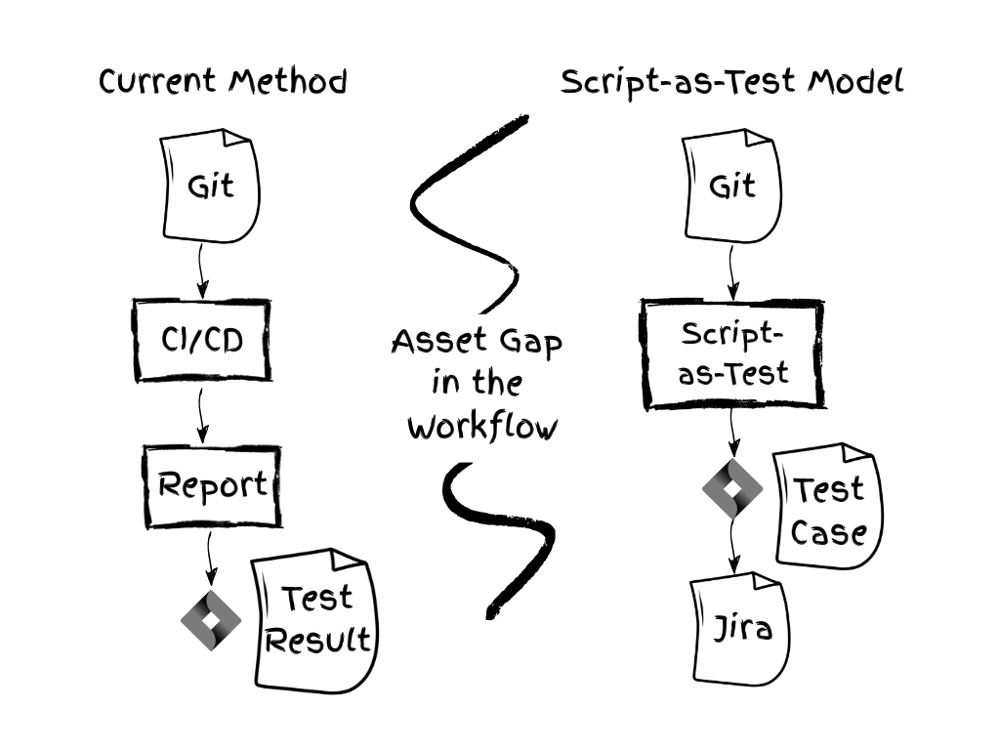
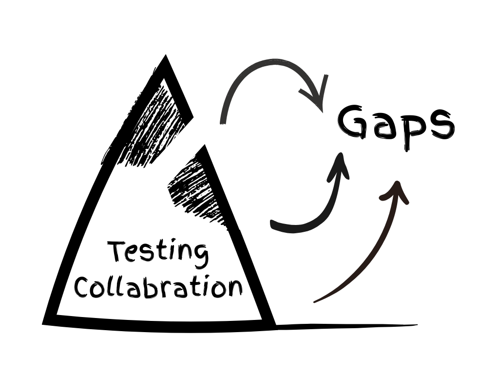
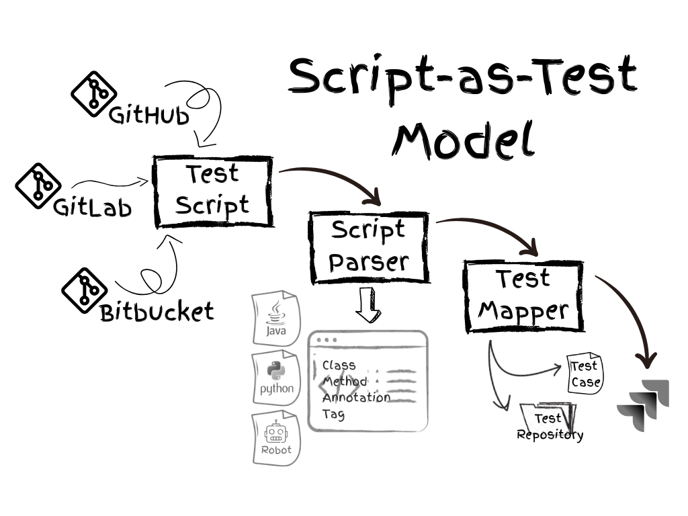
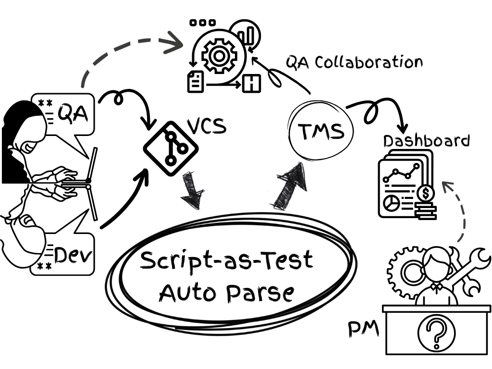
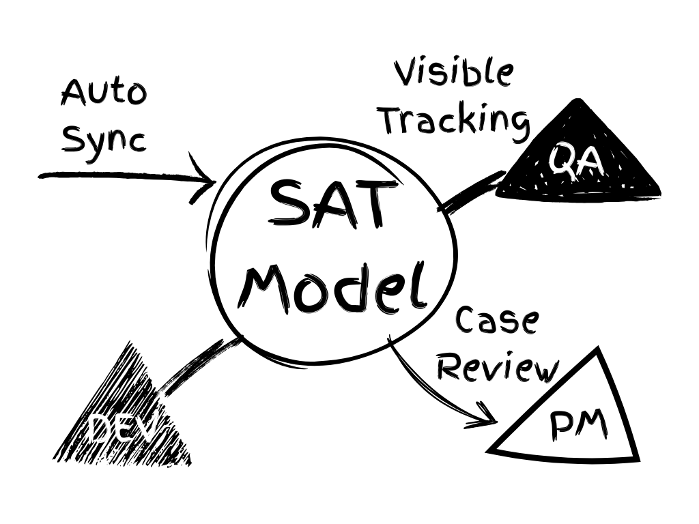

# 📘 Script-as-Test：自动化测试协作模型实战指南

> 测试资产前置法，如何让自动化测试被看见

## 序章：一条被忽视的断层

软件开发的世界里，测试往往被视为一条平行于开发的支流。然而，在今天这个自动化测试日益普及的时代，这条支流与主流的开发流程之间，正在出现一道越来越深的断层。

这种断层并非出现在“是否写了测试脚本”上，而是在于“脚本是否被视为流程资产”。换句话说，脚本被写了、执行了，却没有被“看见”。

企业普遍在用 Jira、TestRail、Xray、Zephyr 等系统管理测试用例，但这些平台上的测试用例，绝大多数仍依赖“人为输入” —— 这里的“人为输入”，不仅指手工填表，也包括一些借助自动化工具完成的流程,例如基于 CI 报告的用例导入。虽然这些方式实现了执行自动化，但测试资产本身仍无法被结构化管理。常见现象包括：

- 测试执行后，手动复制粘贴结果至管理平台；
- CI 平台导入报告，但内容仅限于执行状态；
- 用例缺乏脚本来源、缺乏结构信息、难以追溯。

这些动作背后有一个共同点：**测试脚本与管理流程相互割裂。**即便测试已自动化运行上百次，但 Jira 中的测试资产，仍停留在几条早期创建的静态用例上。

这造成一种悖论：**测试已高度自动化，协作仍靠人工堆砌。**测试协作缺乏系统化整合。

即使部分团队通过 CI 报告导入了测试结果，但脚本不可见、来源不可查、逻辑不可复用，测试资产在流程协作中仍然失效。

那么，我们如何让自动化测试真正融入协作流程？如何让测试资产从“报告”变成“资源”？这就是本指南要解答的问题 —— 我们提出了一种模型：**Script-as-Test（SAT 模型）**。

Script-as-Test 不是新工具，而是一种**新结构**。它试图回答一个核心问题：

> **测试脚本，如何直接成为流程协作的一部分？**

 
## 第1章：自动化测试为什么“看不见”

### 【现象】脚本跑了，用例却看不见

自动化测试的工具越来越多、脚本执行得越来越快、覆盖得越来越广，但一个常见现象是：

> **项目负责人并不知道系统里到底测了什么。**

打开 Jira，只看到稀疏的用例，或者是一张“通过率 93%”的报告，却无法回答：

- 脚本来自哪里？
- 覆盖了哪些模块？
- 是否符合当前需求？

### 【根因】写了测试，但没留下“资产”

CI 平台执行脚本 → 生成报告 → 导入测试结果。

这个链路里，“脚本”只是一次性执行内容，并未以结构化形式沉淀为资产。那些测试代码藏在 GitHub、GitLab、Bitbucket 这些代码仓库中，运行在 CI/CD 流水线中，最后生成一份报告作为成果。

目前常见流程如下：

1. 提交测试脚本（由 Dev 或 QA 编写）
2. CI 平台运行测试
3. 报告生成（如 Allure、JUnit）
4. 通过插件或接口导入结果至 Xray/Zephyr 等测试管理系统
5. 部分情况下生成测试用例（非结构化）

### 【盲点】测试过程与结构缺失

我们来拆解一下问题：

- 导入结果 ≠ 脚本结构
- 有执行记录 ≠ 有可用资产
- 用例名称 ≠ 用例内容

最终 Jira 中只保留：用例标题、状态、执行次数。

测试脚本的来源、版本、变更记录、注释逻辑，全都丢失。无论 CI 跑了多少次，但 Jira 里的用例始终不会有更新。

**当前主流流程是“从执行倒推管理”，而不是“从脚本构建管理”。**

这导致测试用例成为“执行附属物”，而不是“流程资产”。

### 【转机】从脚本出发构建资产

如果能在脚本提交时直接解析、映射为可追溯的用例，那么协作流程将从“看不见 → 看见”，

从“导入报告”改为“同步脚本”，这就是 Script-as-Test 的起点。
 
## 第2章：测试管理的盲区与困局

### 【协作断裂】用例与脚本两个世界

在很多团队里，测试脚本和测试用例是两个完全不同的世界：

- 用例：保存在 Jira、TestRail这样的测试管理平台，由 QA 编写、维护、管理
- 脚本：保存在 GitHub、GitLab、Bitbucket这样的版本控制系统，由 Dev 或者自动化测试工程师编写执行

两者相关，但系统间无自动连接。

测试管理系统无法追踪测试脚本的演进，测试代码的变更也不会自动同步到用例体系。

于是我们看到：明明脚本写了不少，但对于自动化测试而言，用例体系却形同虚设。

### 【可见性不足】执行过程黑箱化

许多测试确实被执行了，甚至每天都在运行。但对管理者来说，看到的却只有 CI 流水线上的一个绿色勾勾或报告中的一行统计数据。

例如无法清楚回答：

- 哪些模块覆盖了？
- 哪些脚本失效了？
- 哪些功能缺少测试？
- 哪些测试是新加的？哪些已废弃？

这些管理所需的信息，在现有报告中难以呈现。

### 【资产沉没】执行 ≠ 沉淀

我们通常以为测试资产是“脚本 + 报告”，但在协作流程中，只有被管理系统识别和引用的部分，才是真正的资产。

如果测试脚本只是被执行，却没有生成结构化的测试用例、没有归档路径、无法回溯，那这些脚本就成了“沉没成本”。

它们可能在某次回归中发挥了作用，却无法被 QA 引用、无法纳入需求覆盖审计，也无法被项目经理理解与追踪。

测试就像河里漂浮的木板，用完即弃，无法拼成流程之“桥”。

### 【治理无源】测试管理失效

没有结构，就谈不上优化；

没有资产，就谈不上责任；

没有脚本可见，就谈不上协作。

这不是单个工具的短板，而是现有流程中，缺失了一个把“脚本”纳入“流程”的桥梁。

Script-as-Test，就是为了解决这个“无源之水”的问题。

 
## 第3章：Script-as-Test 模型的提出

### 【理念来源】不替代流程，而是嵌入流程

SAT 模型，不是一种替代现有流程的工具，而是一种在现有流程上“加一层结构”的机制。

它不是要推翻已有的用例管理平台、CI 流程、测试脚本写作规范，而是找到那条缺失的链条：**让测试脚本直接进入流程视野，成为测试资产的一部分。**

换句话说，它是一种“测试信息结构化同步模型”：从代码提交开始，自动生成、同步、更新测试用例。

### 【三大原则】

SAT 模型建立在三个核心原则上：

1. **脚本即用例**：代码 ≠ 黑箱，代码 = 流程节点

    每一段脚本都应映射为结构化的测试信息，而不是只作为“运行的东西”存在

2. **提交即同步**：脚本提交 → 立即同步为用例

    测试信息的同步节点，应该是 Git 中的脚本提交时刻，而不是测试报告产生之后

3. **流程即可见**：管理以结构为核心，而非报告为唯一

    相比执行本身，是否能被“看见、追溯、管理”才是协作的核心

### 【三步机制】

SAT 模型的基本实现逻辑如下：

1. **提取结构**：识别测试类、方法、注释等脚本结构

    从提交到 GitHub（或其他 Git 平台）的测试代码中，自动识别测试类、测试方法、注释与结构层次。

2. **映射用例**：将结构映射为测试管理系统的用例格式

    将提取结果映射为测试管理平台中的标准“测试用例”格式（如 Xray 中的 Generic Test 或 Manual Test）。

3. **同步协作**：创建/更新测试用例，保留溯源信息

    同步至测试平台后，保留原始代码路径信息、变更时间、作者信息，实现测试用例与测试代码的溯源绑定。

这套流程不依赖执行，不依赖测试报告，不等待 CI 结束。

它的目标很明确：**脚本一提交，就成为管理节点。**

 
## 第4章：模型结构与应用机制

### 【映射方式】语言无关，结构优先

SAT 模型并不依赖某一种测试语言或框架，它的关键在于：**从源代码中识别出可被管理系统理解的结构单元。**

测试语言 | 映射逻辑
----|----
Java | 类 → 文件夹， 方法 → 用例
Python | 类/函数 → 用例， 模块 → 测试集
Robot Framework | 文件 → 测试集， Test Case Keyword → 用例

而其中的注释、标签、路径均可作为元信息同步。

### 【平台对接】SAT 与 Xray 集成方式

以 Xray Cloud 为例，SAT 模型通过 Xray GraphQL 的 REST API 接口实现三种操作：

1. **用例搜索**：检查目标项目是否已有对应用例（避免重复）
2. **用例创建或更新**：将提取出的测试方法结构作为 Generic Test 内容同步
3. **文件夹组织**：按文件路径映射至 Test Repository 中的文件夹，形成结构一致性

此外，在未来的实现中，SAT 模型还可选同步以下附加信息，以进一步增强测试资产的管理价值：

- 脚本路径（保留溯源）
- 最近修改人 & Git 提交摘要
- 测试状态标签（如自动化/回归/冒烟，用于归类和筛选）

### 【适用场景】

SAT 模型特别适合以下场景：

- 自动化脚本多，但用例少
- Dev 与 QA 各自为战，缺少协作桥梁
- PM 想知道“需求是否被测试覆盖”
- 当前只靠报告，不够可溯源

对于刚启动测试管理转型的中小团队，也可作为“测试资产管理的起点”。

**SAT 提供的，是一个“用脚本构建协作资产”的思路**，让自动化不再只是执行，而成为协作的一部分。

 
## 第5章：从测试资产到协作跃迁

### 【角色融合】脚本进入流程

测试脚本一旦被纳入用例体系，就不再只是一个“执行动作”，而是成为整个项目流程中可协作、可溯源、可评价的流程节点。即“脚本 → 用例 → 协作对象”。

QA 可以对接自动化脚本进行评审与补充； 

开发团队也能更清晰地了解，哪些功能点已有对应测试脚本，哪些尚未覆盖；

PM 可以看到完整的覆盖范围与来源路径。

这意味着测试流程的角色从“执行人”变成了“协作者”：透明 + 溯源 + 协作。

### 【统一视图】三方共识

在传统的工作划分中：

- Dev 写代码和脚本，但不一定接触测试管理系统
- QA 维护用例与计划，甚至脚本，但不可能时刻在测试管理系统同步脚本逻辑
- PM 关注交付质量，但依赖 QA 汇总数据

SAT 模型为三者之间建立了“统一可见的测试资产视图”：

- QA 不再靠手动维护用例列表，而是通过同步生成的用例参与协作
- Dev 不再需要额外编写文档，只要写清楚脚本注释与结构即可被系统识别
- PM 能在测试管理系统中直接看到“测试覆盖率、执行状态、脚本逻辑及来源”三位一体的数据链

SAT 是协作的中台，不是执行的外包。

### 【闭环文化】测试是流程的一部分

测试团队常常处于流程之外：他们的成果既不在代码中，也不在项目数据流中。

而 SAT 模型提供了一种新的可能性：

> 测试脚本 → 用例同步 → 流程可见 → 协作统一

使得测试不是孤岛，而是闭环：

> 测试 → 协作 → 管理 → 改进 → 反哺测试

这是一种信息流的“闭环”，也是一种文化上的“融入”。

 
## 总结：让自动化成为协作的起点

测试流程的数字化，不该止步于自动执行。 真正的协作，需要每一个参与者都能“看到”，也要“被看见”。

Script-as-Test 模型的提出，旨在解决当前测试管理中的协作盲区，它让测试脚本可被看见、可被审计、可被管理，这是对当下测试资产沉没问题的一种回应。 

它试图在技术日益自动化的同时，让协作关系也更清晰、信息更可溯源、用例更可维护。

它并不复杂，也不试图替代任何一环，而是在既有工具和实践中，加上一层结构，加上一个看见的视角。

希望本指南能帮助你重新理解“测试资产”的含义，思考自动化之外的“管理价值”，并在适合的团队中尝试落地。

愿这套思路，帮助更多团队：

**从测试执行者，走向测试协作者。**

> Script-as-Test 是我提出的一个方法，也是邀请你共创的一种未来。
> —— Will Shi (石巍 / SHI WEI)

 
## 版权与联系信息

Script-as-Test 模型由 Will Shi (石巍 / SHI WEI) 提出。

本指南版权归作者 Will Shi (石巍 / SHI WEI) 所有，欢迎引用、转发，但请注明出处。

如您希望交流 SAT 方法论的落地实践，或获取 Jira 插件使用支持，欢迎通过以下方式联系作者：

- 📧 邮箱：will.shi@tman.ltd
- 🌐 官网：https://en.tman.ltd
- 📘 微信公众号：数字化转型怎么做
- 💼 LinkedIn：https://www.linkedin.com/in/bxwill/

如果您希望在团队中引入 SAT 模型，或需要定制化测试管理方案，也欢迎商务合作洽谈。

Script-as-Test，是一次尝试，也是一次共创的邀请。
 
## 附录

### 📌 插件概览： AutoTestCase Extractor

AutoTestCase Extractor 是基于 SAT 模型理念构建的 Jira Forge 插件，具备以下核心功能：

- 从 GitHub 自动提取 Java 测试脚本结构
- 映射并同步为 Xray 测试用例（支持 Generic Test 类型）
- 支持配置路径、分支、Test Repository 文件夹等信息
- 零部署、轻量级使用，适合测试管理可视化起步

### 🛠️ 支持情况

功能模块 | 当前状态
----|----
Java、Python、RobotFramework | ✅ 已实现
GitHub 支持	| ✅ 已实现
GitLab / Bitbucket | 🚧 开发中
Xray Cloud 同步 | ✅ 已实现
Zephyr 系列支持 | 📝 评估中

### 📚 常用术语释义

- Script-as-Test（SAT）：将测试脚本结构化为可见、可协作的测试用例资产的管理理念。
- Test Asset（测试资产）：指可以被识别、管理、追踪的测试相关实体，如用例、脚本、报告。
- Generic Test：Xray 支持的一种通用测试类型，用于接收外部同步的脚本或非结构化用例信息。
- Test Repository：Xray 中用于组织测试用例的文件夹结构，类似于代码目录树。
- CI/CD 报告导入：从 Jenkins、GitHub Actions 等平台生成测试报告，并导入测试管理系统的方式。

### 💬 常见问题 FAQ

> Q1：插件是否支持非 Java 语言？ 

目前支持 Java、Python 和 Robot Framework 的测试用例提取。

> Q2：插件是否需要本地安装？ 

不需要，插件基于 Atlassian Forge 平台，无需本地部署。待通过 Atlassian Marketplace 审核并正式上架后，您可以直接在 Marketplace 搜索并安装 AutoTestCase Extractor。

若因审核流程或其他因素导致暂时无法上架，欢迎通过 will.shi@tman.ltd 联系我们获取安装方式和使用支持。作为个人开发者，我会尽力推动上架进度，也欢迎提前来信体验与反馈。

插件说明文档：https://docs.tman.ltd/atce/overview

> Q3：插件支持私有 GitLab 或 Bitbucket Server 吗？ 

当前仅支持 GitHub 公有云。由于 Forge 限制，暂不支持私有域名访问。但未来会考虑支持 GitLab 公有云和 Bitbucket 公有云。

> Q4：如何试用？ 

待插件公开上架申请通过审核，在 Atlassian Marketplace 搜索 “AutoTestCase Extractor”，点击安装即可享受 14 天免费试用期。

> Q5：Script-as-Test 是开源框架吗？ 

SAT 是一种流程理念，当前通过两种实现方式落地：

- Jira 插件 [AutoTestCase Extractor](https://docs.tman.ltd/atce/overview)（零部署、基于 Forge）
- 命令行工具 [Atlassian ATC Manager](https://pypi.org/project/atlassian-auto-test-case-manager/)（[GitHub 开源项目](https://github.com/TMAN-Lab/tman-atlassian-atc-manager)，需配合 CI/CD 执行） 

两者都体现了 Script-as-Test 的核心思想。
