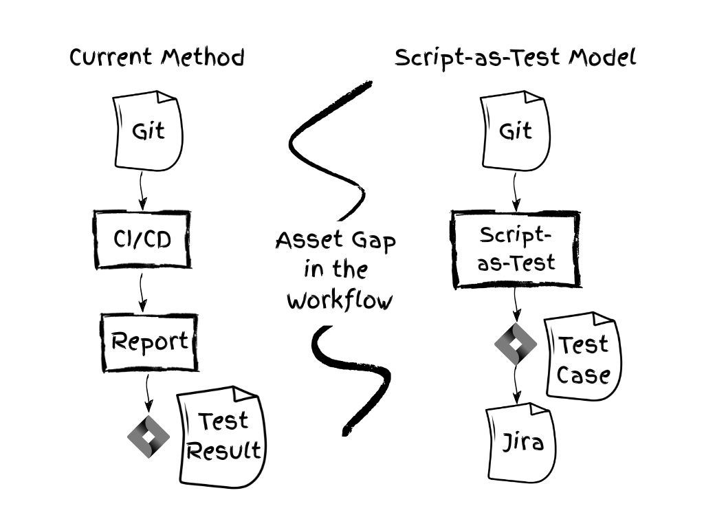
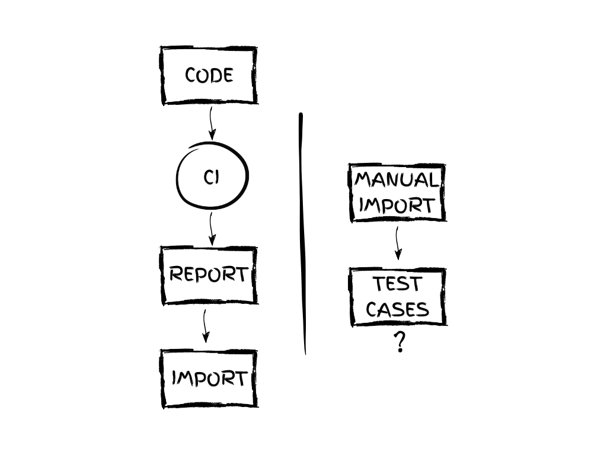
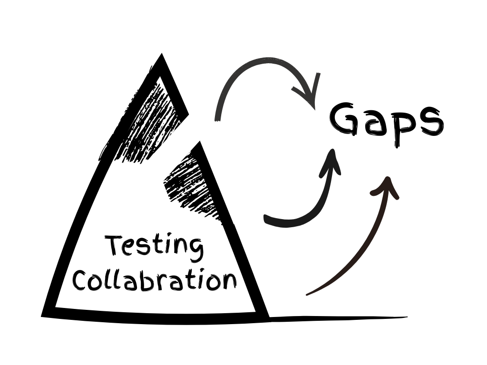
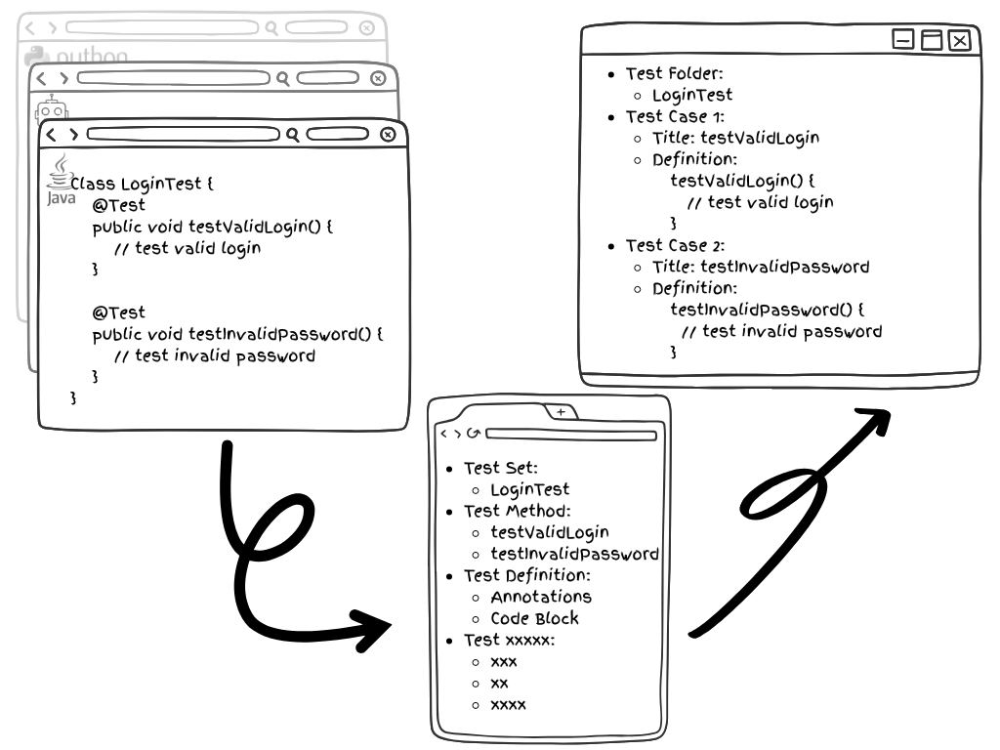
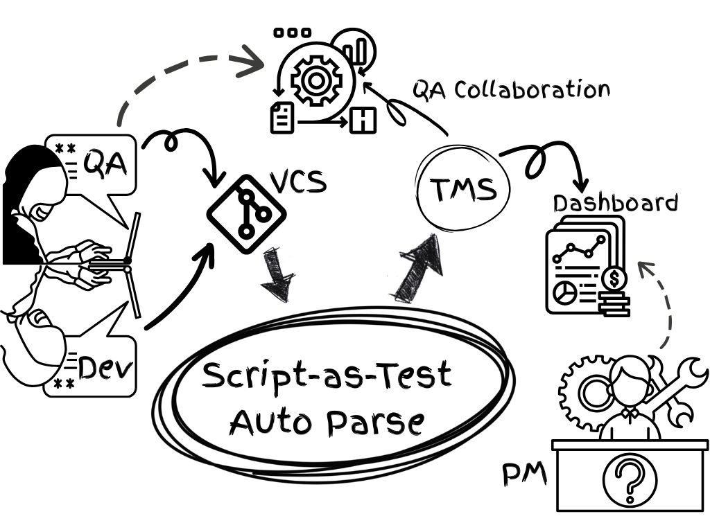
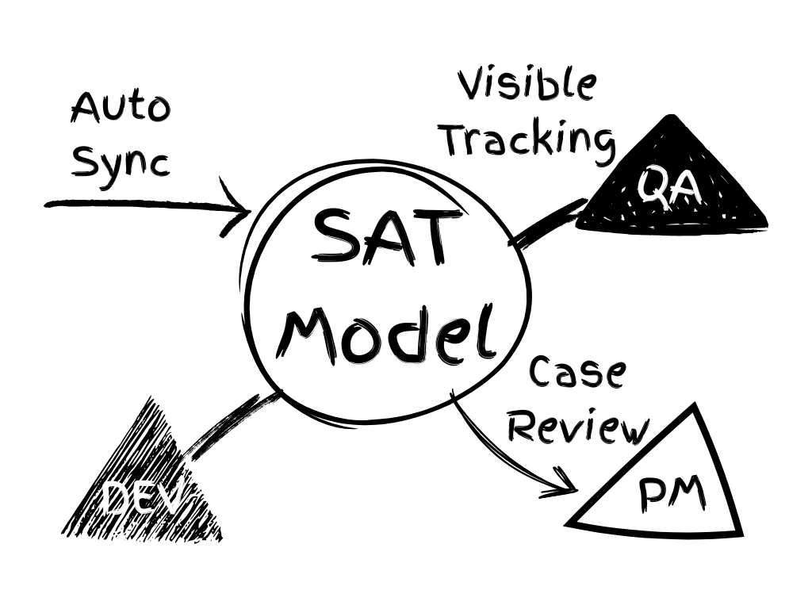

# 📘 Script-as-Test：自動化測試協作模型白皮書

> 測試資產前置法，讓自動化測試被看見的關鍵

## 序章：一條被忽略的斷層

在軟體開發的世界裡，測試常被視為與開發平行的支流。然而，在自動化測試日漸普及的今天，這條支流與主流程之間，正逐漸出現一道愈來愈深的斷層。

這道斷層並不在於「是否有寫測試腳本」，而在於「腳本是否被視為流程資產」。換句話說，腳本寫了，也執行了，卻沒能被「看見」。

企業普遍使用 Jira、TestRail、Xray、Zephyr 等系統管理測試案例，但這些平台上的測試案例，大多仍仰賴「人工輸入」—— 這裡的「人工輸入」，不僅指手動填表，也包括一些透過自動化工具完成的流程，例如根據 CI 報告匯入用例。儘管這些方式實現了執行自動化，但測試資產本身仍無法被結構化管理。常見現象包括：

- 測試執行後，手動複製貼上結果至管理平台；
- CI 平台匯入報告，但內容僅限於執行狀態；
- 測試案例缺乏腳本來源、缺乏結構資訊、難以追溯。

這些行為背後有一個共通點：**測試腳本與管理流程是割裂的。**即便測試已自動化執行上百次，但 Jira 中的測試資產，仍停留在幾條早期建立的靜態案例上。

這造成一個悖論：**測試已高度自動化，協作卻仍靠人工堆砌。**測試協作缺乏系統化整合。

即使有些團隊透過 CI 報告匯入測試結果，但腳本不可見、來源無法查證、邏輯無法重用，測試資產在流程協作中仍然失效。

那麼，我們要如何讓自動化測試真正融入協作流程？如何讓測試資產從「報告」變成「資源」？這正是本白皮書所要解答的問題 —— 我們提出了一種模型：**Script-as-Test（SAT 模型）**。

Script-as-Test 並不是一項新工具，而是一種**新結構**。它試圖回答一個核心問題：

**測試腳本，如何直接成為流程協作的一部分？**

## 第1章：自動化測試為何「看不見」

### 【現象】腳本跑了，用例卻消失了

自動化測試工具愈來愈多，腳本執行愈來愈快、涵蓋範圍愈來愈廣，但一個常見的現象是：

**專案負責人根本不知道系統到底測了什麼。**

打開 Jira，只看到零星的用例，或一張「通過率 93%」的報告，卻無法回答：

- 腳本來自哪裡？
- 覆蓋了哪些模組？
- 是否符合目前需求？

### 【根本原因】測試寫了，卻沒留下「資產」

CI 平台執行腳本 → 產生報告 → 匯入測試結果。

這條鏈路中，「腳本」只是一次性的執行內容，並未以結構化的方式沉澱為資產。這些測試代碼藏在 GitHub、GitLab、Bitbucket 等代碼倉庫中，執行於 CI/CD 流水線中，最終產出一份報告作為成果。

目前常見的流程如下：

1. 提交測試腳本（由開發或測試人員撰寫）
2. CI 平台執行測試
3. 產生報告（如 Allure、JUnit）
4. 透過插件或 API 將結果匯入至 Xray/Zephyr 等測試管理系統
5. 在部分情況下自動產生測試用例（但非結構化）

### 【盲點】測試過程與結構缺失

讓我們拆解一下問題：

- 匯入結果 ≠ 腳本結構
- 有執行記錄 ≠ 有可用資產
- 用例名稱 ≠ 用例內容

最終 Jira 中只保留：用例標題、狀態、執行次數。

測試腳本的來源、版本、變更記錄、註解邏輯，全都遺失。無論 CI 執行了多少次，Jira 裡的用例始終不會自動更新。

**目前主流流程是「從執行倒推管理」，而非「從腳本構建管理」。**

這導致測試用例成為「執行的附屬品」，而非「流程資產」。

### 【轉機】從腳本出發構建資產

如果能在提交腳本時即解析並映射為可追溯的測試用例，那麼協作流程將從「看不見 → 看得見」，

從「匯入報告」轉向「同步腳本」，這正是 Script-as-Test 的起點。

## 第2章：測試管理的盲區與困局

### 【協作斷裂】用例與腳本是兩個世界

在許多團隊中，測試腳本與測試用例是完全不同的兩個世界：

- 用例：儲存在 Jira、TestRail 等測試管理平台中，由 QA 撰寫、維護與管理；
- 腳本：儲存在 GitHub、GitLab、Bitbucket 等版本控制系統中，由開發或自動化測試工程師撰寫與執行。

兩者雖有關聯，卻缺乏系統之間的自動連接。

測試管理系統無法追蹤測試腳本的演進，測試代碼的變更也無法自動同步到用例體系。

於是我們看到：明明腳本寫了一堆，但對於測試管理而言，用例體系卻形同虛設。

### 【可見性不足】執行過程如黑箱

許多測試的確被執行了，甚至每日例行運行。但對管理者而言，看到的只是 CI 流水線上的一個綠色勾勾，或報告中的統計數據。

例如無法清楚回答：

- 哪些模組已被覆蓋？
- 哪些腳本失效了？
- 哪些功能尚缺乏測試？
- 哪些測試是新增的？哪些已廢棄？

這些管理所需的資訊，在現有的測試報告中難以呈現。

### 【資產沉沒】執行 ≠ 沉澱

我們常以為測試資產是「腳本 + 報告」，但在協作流程中，唯有被管理系統識別與引用的部分，才是真正的資產。

若測試腳本僅是被執行，卻未生成結構化的測試用例、未建立歸檔路徑、無法回溯，那這些腳本就成了「沉沒成本」。

它們或許在某次回歸測試中發揮了作用，卻無法被 QA 引用、無法納入需求覆蓋審計，也無法被專案經理理解與追蹤。

測試如同漂浮在河流上的木板，用完即丟，無法拼成流程之「橋」。

### 【治理無源】測試管理失效

沒有結構，就無從優化；

沒有資產，就無從問責；

沒有腳本可見，就無從協作。

這不是單一工具的問題，而是當前流程中，缺失了一座將「腳本」納入「流程」的橋樑。

Script-as-Test 模型，正是為了解決這個「無源之水」的問題。

## 第3章：Script-as-Test 模型的提出

### 【理念來源】不是取代流程，而是嵌入流程

SAT 模型，不是一套取代現有流程的工具，而是一種在原有流程上「加一層結構」的機制。

它不試圖推翻既有的測試管理平台、CI 流程、腳本規範，而是找到那條遺失的鏈條：**讓測試腳本直接進入流程視野，成為測試資產的一部分。**

換句話說，它是一種「測試資訊結構化同步模型」：從代碼提交開始，自動生成、同步、更新測試用例。

### 【三大原則】

SAT 模型建立於三個核心原則之上：

1. **腳本即用例**：代碼 ≠ 黑箱，代碼 = 流程節點

    每段腳本都應映射為結構化的測試資訊，而非僅為「可執行物件」。

2. **提交即同步**：腳本一提交 → 即同步為用例

    測試資訊的同步節點應設於 Git 中的腳本提交時，而非等測試報告產生後。

3. **流程即可見**：以結構為管理核心，而非報告為唯一依據

    比起執行本身，「能否被看見、追蹤、管理」才是協作的關鍵。

### 【三步機制】

SAT 模型的實作邏輯包含三個步驟：

1. **提取結構**：識別測試類別、方法、註解等腳本結構

    從提交至 GitHub（或其他 Git 平台）的測試代碼中，自動解析測試類、方法、註解與層級結構。

2. **映射用例**：將結構轉為測試管理系統可識別的格式

    將提取結果映射為測試平台中的標準測試用例格式（如 Xray 中的 Generic Test 或 Manual Test）。

3. **同步協作**：建立／更新用例，保留溯源資訊

    同步至測試平台後，保留原始代碼路徑、變更時間、作者資訊，實現測試用例與腳本之溯源綁定。

這套流程不依賴於執行報告，不等待 CI 結束。

它的核心目標明確：**腳本一提交，即成為管理節點。**

## 第4章：模型結構與應用機制

### 【映射方式】語言無關，重點在結構

SAT 模型並不依賴特定的測試語言或框架，它的核心在於：**從原始碼中識別出可被管理系統理解的結構單元。**

測試語言 | 映射邏輯
----|----
Java | 類別 → 資料夾， 方法 → 測試用例
Python | 類別／函式 → 測試用例， 模組 → 測試集
Robot Framework | 檔案 → 測試集， Test Case Keyword → 測試用例

其中的註解、標籤、路徑等資訊皆可作為元資料同步。

### 【平台對接】SAT 與 Xray 的整合方式

以 Xray Cloud 為例，SAT 模型透過 Xray GraphQL 的 REST API 實現三項操作：

1. **用例查詢**：檢查目標專案是否已有對應測試用例（避免重複建立）
2. **用例建立或更新**：將提取出的測試方法作為 Generic Test 的內容進行同步
3. **資料夾組織**：根據原始檔案路徑，在 Test Repository 中建立對應結構，保證一致性

未來亦可選擇同步以下資訊，以增強測試資產的管理價值：

- 腳本路徑（保留溯源）
- 最近修改者 & Git 提交摘要
- 測試分類標籤（如 自動化／回歸／冒煙，用於分類與篩選）

### 【適用場景】

SAT 模型特別適合下列情境：

- 自動化腳本數量多，但測試用例少
- Dev 與 QA 各自為政，缺乏協作橋梁
- PM 想追蹤「哪些需求被測試覆蓋」
- 當前僅靠測試報告，不足以支持審計與回溯

對於剛起步導入測試管理的中小型團隊，SAT 也可作為「資產管理的起點」。

**SAT 帶來的，是一種用腳本構建可視協作資產的思路**，讓自動化不再只是執行工具，而是流程的一部分。

## 第5章：從測試資產到協作躍遷

### 【角色融合】腳本走入流程核心

一旦測試腳本被納入用例體系，它就不再只是單一的「執行動作」，而是成為專案流程中的可協作、可溯源、可評價的節點。即「腳本 → 用例 → 協作對象」。

QA 可檢視與補強自動化腳本；

Dev 能清晰知道哪些功能已有對應測試、哪些尚未覆蓋；

PM 可以追蹤測試覆蓋範圍與來源路徑。

這代表測試流程中的參與者，從「執行者」轉變為「協作者」：透明化 + 可追溯 + 協作驅動。

### 【統一視圖】三方共識的建立

傳統職能分工下：

- Dev 撰寫程式與腳本，但不一定登入測試管理系統；
- QA 維護用例與測試計畫，偶爾寫腳本，但難以即時同步至管理平台；
- PM 關心交付品質，但依賴 QA 匯整資訊。

SAT 模型則建立一個「三方共用的測試資產視圖」：

- QA 不必手動維護用例列表，而是透過同步自動產生用例來進行協作；
- Dev 不需要額外寫文檔，只要清楚寫好腳本註解與結構即可被系統識別；
- PM 能在測試管理系統中直接看到「測試覆蓋率、執行狀態、腳本邏輯與來源」三合一的資料鏈。

SAT 是協作的中台，不是執行的外包。

### 【閉環文化】讓測試融入流程主線

測試團隊常常被邊緣化：他們的成果既不在代碼中，也不在主流程資料中。

SAT 模型提供了一條新路徑：

測試腳本 → 用例同步 → 流程可見 → 協作一致

使得測試不再是資訊孤島，而成為閉環：

測試 → 協作 → 管理 → 改進 → 再反哺測試

這不僅是資訊流程的「閉環」，也是文化上的「融入與重構」。

## 總結：讓自動化成為協作的起點

測試流程的數位化，不應止步於自動執行。真正的協作，需要每一位參與者都能「看見」，也「被看見」。

Script-as-Test 模型的提出，正是為了解決當前測試管理中的協作盲區，它讓測試腳本變得可見、可審計、可管理，是對「測試資產沉沒」問題的具體回應。

它試圖在技術日益自動化的同時，讓協作關係更清晰、資訊更可追溯、用例更可維護。

它不複雜，也不試圖取代現有工具，而是在既有實踐中，加上一層結構，一個讓人「看見」的視角。

希望本白皮書能幫助你重新理解「測試資產」的意義，思考自動化之外的「管理價值」，並在適合的團隊中推動落地實踐。

願這套思路，幫助更多團隊：

從測試執行者，走向測試協作者。

> Script-as-Test 是我提出的方法，也是一場誠摯邀請你共創的未來。
> —— Will Shi（石巍 / SHI WEI）

## 版權與聯絡資訊

Script-as-Test 模型由 Will Shi（石巍 / SHI WEI）提出。

本白皮書版權歸作者 Will Shi（石巍 / SHI WEI）所有，歡迎轉載與引用，但請註明出處。

如您希望交流 SAT 方法論的落地實踐，或需 Jira 外掛使用支援，請透過以下方式聯繫作者：

- 📧 電子信箱：will.shi@tman.ltd
- 🌐 官方網站：https://en.tman.ltd
- 📘 Medium：https://bxwill.medium.com
- 💼 LinkedIn：https://www.linkedin.com/in/bxwill/

若您有意在團隊中引入 SAT 模型，或需要量身打造的測試管理解決方案，也歡迎洽談合作。

Script-as-Test，是一次嘗試，也是一場共創的邀請。

## 附錄

### 📌 外掛概覽：AutoTestCase Extractor

AutoTestCase Extractor 是一款基於 SAT 模型理念開發的 Jira Forge 外掛，具備以下核心功能：

- 從 GitHub 自動提取 Java 測試腳本結構
- 映射並同步為 Xray 測試用例（支援 Generic Test 類型）
- 支援自訂路徑、分支、Test Repository 資料夾等資訊
- 零部署、輕量使用，適合測試管理可視化初期導入

### 🛠️ 支援狀態

功能模組 | 當前狀態
----|----
Java、Python、RobotFramework | ✅ 已實作
GitHub 支援 | ✅ 已實作
GitLab / Bitbucket | 🚧 開發中
Xray Cloud 同步 | ✅ 已實作
Zephyr 系列支援 | 📝 評估中

### 📚 常用術語釋義

- Script-as-Test（SAT）：將測試腳本結構化為可見、可協作之測試資產的管理理念。
- Test Asset（測試資產）：可被識別、管理、追蹤的測試實體，如用例、腳本、報告等。
- Generic Test：Xray 支援的一種通用測試類型，用於同步外部腳本或非結構化用例內容。
- Test Repository：Xray 中用於組織測試用例的資料夾架構，類似原始碼目錄。
- CI/CD 報告匯入：從 Jenkins、GitHub Actions 等平台產生測試報告並導入測試平台的方式。

### 💬 常見問題 FAQ

> Q1：外掛是否支援非 Java 語言？

目前支援 Java、Python 與 Robot Framework 的測試用例提取。

> Q2：外掛是否需要本地安裝？

不需要，外掛基於 Atlassian Forge 平台，無需本地部署。待通過 Atlassian Marketplace 審核並正式上架後，您可以直接在 Marketplace 搜尋並安裝 AutoTestCase Extractor。

若因審核流程或其他因素導致暫時無法上架，歡迎透過 will.shi@tman.ltd 聯繫我們獲取安裝方式與使用支援。作為個人開發者，我會盡力推動上架進度，也歡迎提前來信體驗與反饋。

外掛說明文件：https://docs.tman.ltd/atce/overview

> Q3：外掛支援私有 GitLab 或 Bitbucket Server 嗎？

目前僅支援 GitHub 公有雲。由於 Forge 的限制，暫不支援私有網域訪問。但未來將考慮支援 GitLab Cloud 與 Bitbucket Cloud。

> Q4：如何試用？

待外掛通過 Marketplace 審核公開上架後，在 Atlassian Marketplace 搜尋「AutoTestCase Extractor」，點擊安裝即可享有 14 天免費試用期。

> Q5：Script-as-Test 是開源框架嗎？

SAT 是一種流程理念，目前透過兩種實作方式落地：

- Jira 外掛 [AutoTestCase Extractor](https://docs.tman.ltd/atce/overview)（零部署、基於 Forge）
- 命令列工具 [Atlassian ATC Manager](https://pypi.org/project/atlassian-auto-test-case-manager/)（[GitHub 開源專案](https://github.com/TMAN-Lab/tman-atlassian-atc-manager)，需配合 CI/CD 運行）

兩者皆體現 SAT 模型的核心思想。
